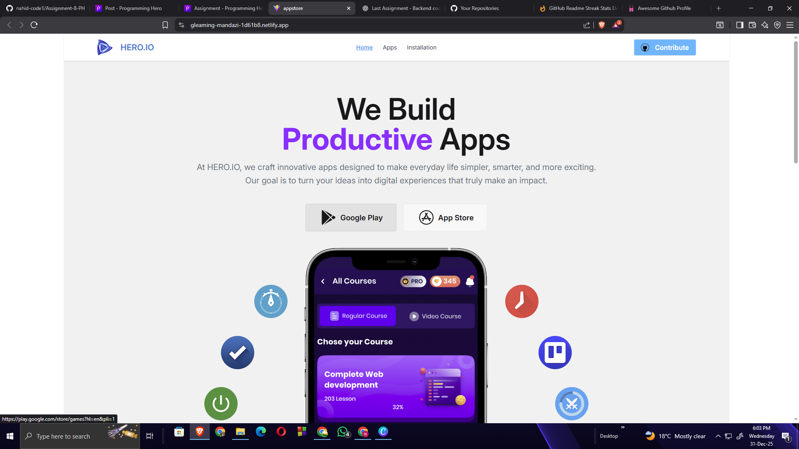

# Project Name

## 🔗 Live Link
[Live Project Link](https://gleaming-mandazi-1d61b8.netlify.app/)

---

##  Project Overview
This is a frontend web application developed as part of the Programming Hero Level-1 course.  
The project focuses on responsive UI, clean design, and interactive functionality.

---

##  Screenshot


---

##  Technologies Used
- HTML
- CSS
- JavaScript
- Tailwind CSS

---

##  Core Features
- User-friendly UI
- Clean and structured code

---

##  Dependencies
- tailwindcss
- toastify

---

##  How to Run Locally

```bash
git clone https://github.com/your-username/project-name.git
cd project-name
npm install
npm run dev

